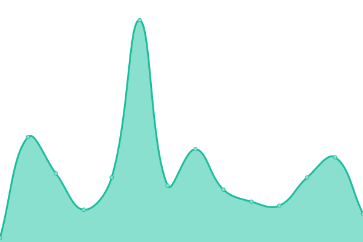

# [📈 Live Status](https://status.lls.fr): <!--live status--> **🟩 All systems operational**

This repository contains the open-source uptime monitor and status page for [Lelivrescolaire](https://www.lelivrescolaire.fr), powered by [Upptime](https://github.com/upptime/upptime).

With [Upptime](https://upptime.js.org), you can get your own unlimited and free uptime monitor and status page, powered entirely by a GitHub repository. We use [Issues](https://github.com/lelivrescolaire/status-page/issues) as incident reports, [Actions](https://github.com/lelivrescolaire/status-page/actions) as uptime monitors, and [Pages](https://status.lls.fr) for the status page.

<!--start: status pages-->
<!-- This summary is generated by Upptime (https://github.com/upptime/upptime) -->
<!-- Do not edit this manually, your changes will be overwritten -->
<!-- prettier-ignore -->
| URL | Status | History | Response Time | Uptime |
| --- | ------ | ------- | ------------- | ------ |
|  [lls-front](https://www.lelivrescolaire.fr) | 🟩 Up | [lls-front.yml](https://github.com/lelivrescolaire/status-page/commits/master/history/lls-front.yml) | 

 109ms
     
 | 

<a href="https://status.lls.fr/history/lls-front">100.00%</a>
    

|  lls-backend-nodejs | 🟩 Up | [lls-backend-nodejs.yml](https://github.com/lelivrescolaire/status-page/commits/master/history/lls-backend-nodejs.yml) | 

 23ms
     
 | 

<a href="https://status.lls.fr/history/lls-backend-nodejs">100.00%</a>
    

|  [afterclasse-front](https://www.afterclasse.fr) | 🟩 Up | [afterclasse-front.yml](https://github.com/lelivrescolaire/status-page/commits/master/history/afterclasse-front.yml) | 

 246ms
     
 | 

<a href="https://status.lls.fr/history/afterclasse-front">100.00%</a>
    

|  oklm-nodejs | 🟩 Up | [oklm-nodejs.yml](https://github.com/lelivrescolaire/status-page/commits/master/history/oklm-nodejs.yml) | 

 25ms
     
 | 

<a href="https://status.lls.fr/history/oklm-nodejs">100.00%</a>
    

|  lls-front-dev | 🟩 Up | [lls-front-dev.yml](https://github.com/lelivrescolaire/status-page/commits/master/history/lls-front-dev.yml) | 

 272ms
     
 | 

<a href="https://status.lls.fr/history/lls-front-dev">99.98%</a>
    

|  api-dev | 🟩 Up | [api-dev.yml](https://github.com/lelivrescolaire/status-page/commits/master/history/api-dev.yml) | 

 15ms
     
 | 

<a href="https://status.lls.fr/history/api-dev">99.60%</a>
    

<!--end: status pages-->

[**Visit our status website →**](https://status.lls.fr)

## 📄 License

- Powered by: [Upptime](https://github.com/upptime/upptime)
- Code: [MIT](./LICENSE) © [Lelivrescolaire](https://www.lelivrescolaire.fr)
- Data in the `./history` directory: [Open Database License](https://opendatacommons.org/licenses/odbl/1-0/)
